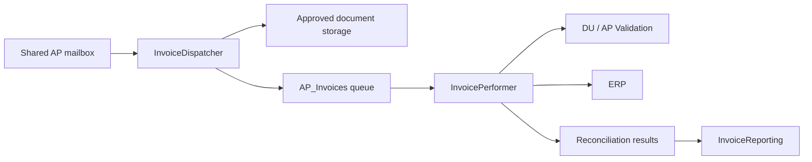

# Solution Design Document — Invoice Processing & Vendor Payment Reconciliation

## Planner Handoff

<!-- planner-handoff:v1 -->

| Field | Value |
|---|---|
| Execution autonomy | Autonomous |
| Delivery model | Existing company Orchestrator tenant; hosting/version to be confirmed |
| SDD scope | Multi-project UiPath RPA Solution |
| Project list section | §10 / §11 |
| Tasks file | `invoice-processing-reconciliation-tasks.md` |
| Generated by | uipath-planner |
| Generation date | 2026-07-20 |

## Decisions Made

1. Implement a Dispatcher, REFramework Performer, and Reporting process as a single deployable solution.
2. Use `AP_Invoices` as the durable system-of-work boundary.
3. Require Document Understanding confidence checks and AP validation before ERP posting.
4. Store source PDFs and evidence centrally, not on robot disks.
5. Prevent duplicate posting before queue creation and immediately before ERP submission; reconcile ambiguous submit results in ERP first.

## 1. Delivery Team

| Role | Responsibility |
|---|---|
| Finance AP Process Owner | Rules, tolerance, exception ownership, acceptance |
| UiPath Platform Owner | Folder, runtime, queues, assets, storage, release access |
| RPA Developer | Dispatcher and Performer build/test |
| ERP Owner | Posting rules, duplicate-search method, non-production access |
| Security/Compliance | Mailbox, retention, and masking controls |

## 2. Process Overview

The automation ingests vendor invoice PDFs from the shared AP mailbox, extracts and validates data, posts eligible invoices to the ERP, and reconciles every final outcome. It covers email intake, secure storage, queues, Document Understanding, human validation, vendor/PO/tolerance checks, ERP posting, exception handling, reporting, and monitoring. Payment release, vendor-master maintenance, and changes to ERP policy are out of scope.

**Capacity/SLA:** `[SME REVIEW]` volume, peak window, SLA, and robot concurrency. Design default: 1–4 concurrent Performers, constrained by ERP capacity.

## 3. Detailed Process Steps

1. Dispatcher reads candidate unread messages from the approved AP mailbox.
2. It validates PDF attachments, calculates SHA-256 hash, and stores source documents centrally.
3. It creates a unique `AP_Invoices` item; only then marks/moves the email.
4. Performer retrieves one queue transaction using REFramework.
5. Document Understanding digitizes/extracts invoice headers and line items.
6. Low-confidence or incomplete extraction routes to AP validation.
7. Performer validates vendor, PO, currency, tax, and total against authoritative sources.
8. Performer checks for duplicate ERP posting, posts valid invoices, and captures confirmation.
9. Performer stores reconciliation data and final queue status.
10. Reporting reconciles control totals and sends a masked daily summary.

## 4. Business Rules

| ID | Rule |
|---|---|
| BR-01 | A document must be an approved PDF with all required fields after validation. |
| BR-02 | Vendor must be active and PO valid where finance policy requires it. |
| BR-03 | Total variance must remain within `AmountTolerance`. |
| BR-04 | Confidence below `DocumentConfidenceThreshold` requires AP validation. |
| BR-05 | Duplicate key is `[SME REVIEW]` `VendorId + InvoiceNumber`, supplemented as approved by ERP policy. |
| BR-06 | An uncertain ERP submit response must be searched/reconciled before any retry. |

## 5. Data Definitions

### AP_Invoices queue item SpecificContent

| Key | Type | Description |
|---|---|---|
| QueueReference | String | Deterministic duplicate-control reference |
| SourceEmailId | String | Source email identifier |
| SenderAddress | String | Traceability sender |
| ReceivedUtc | String | Receipt timestamp |
| StorageUri | String | Approved source PDF location |
| FileName | String | Original attachment name |
| FileHash | String | SHA-256 document hash |
| CorrelationId | String | End-to-end trace identifier |

### Output data

`VendorId`, `InvoiceNumber`, `InvoiceDate`, `PurchaseOrder`, `Currency`, `ExtractedTotal`, `ValidationStatus`, `ERPDocumentNumber`, and `FinalDisposition` (Posted, BusinessException, SystemFailed, AwaitingValidation).

## 6. Value Mappings

| Source | Target |
|---|---|
| Invoice vendor name | ERP vendor ID from approved vendor master |
| Invoice number | ERP supplier invoice reference |
| Total/currency | ERP invoice total/currency |
| PO number | ERP purchase-order reference |

Tax treatment, mandatory ERP fields, and exact field mappings are `[SME REVIEW]` with the ERP owner.

## 7. Exception Handling

| ID | Exception | Trigger | Action |
|---|---|---|---|
| B1 | Invalid document | Non-PDF, corrupt, required fields missing | Business Exception; retain evidence; notify AP |
| B2 | Low confidence/rejected validation | Threshold not met or AP rejects | Hold; no posting |
| B3 | Vendor/PO failure | Unknown vendor, bad PO, currency mismatch | Business Exception with expected/extracted values |
| B4 | Tolerance/duplicate failure | Out-of-tolerance or prior invoice | Do not post; retain control evidence |
| B5 | Ambiguous post | Timeout after submit | Search ERP; complete only if posting is proven |

Unexpected business errors are not retried. System failures (mailbox, storage, DU, ERP/UI, Orchestrator) receive a correlation ID, safe cleanup, and up to two retries only when no posting has occurred. Credential/access failures stop immediately and never log secrets.

## 8. Error Handling

| Error | Retry | Control |
|---|---|---|
| Mailbox/storage connectivity | 2 | Preserve email state; alert after exhaustion |
| DU/validation service | 2 | Retain document and evidence |
| ERP/UI timeout/crash/session expiry | Queue retry 2 | Screenshot where permitted; reset app/session |
| Orchestrator queue/asset/bucket | 2 | Stop safely; notify platform support |
| Credential/access failure | 0 | Stop; escalate to platform support |

## 9. Application Inventory

| Application | Interface | Access Method | Role |
|---|---|---|---|
| Shared AP mailbox | Email | `[SME REVIEW]` Graph, EWS, or IMAP | Source |
| Orchestrator | Web/API | Existing company tenant | Queues, assets, storage, monitoring |
| Document Understanding | Service | `[SME REVIEW]` approved endpoint/model | Extraction |
| Vendor/PO source | Excel/SQL/API | `[SME REVIEW]` authoritative source | Validation |
| ERP | Web/Desktop/API | `[SME REVIEW]` approved route | Posting |
| Action Center/AP mailbox | Web/email | Existing company service | Validation/notifications |

## 10. Master Project Architecture

| Project | Type | Role | Framework | Input Queue | Output Queue |
|---|---|---|---|---|---|
| `InvoiceDispatcher` | Process | Email intake and queue creation | Sequence | — | `AP_Invoices` |
| `InvoicePerformer` | Process | DU, validation, ERP posting, audit | REFramework | `AP_Invoices` | — |
| `InvoiceReporting` | Process | Daily reconciliation and notifications | Sequence | — | — |

## 11. Project Structure

- **InvoiceDispatcher (Sequence):** `Main.xaml`; `ReadMailbox.xaml`, `StoreDocument.xaml`, `CreateQueueItem.xaml`, `FinalizeEmail.xaml`; `Data/Config.xlsx`; `Tests/`.
- **InvoicePerformer (REFramework):** standard `Framework/`; `ExtractInvoice.xaml`, `ValidateInvoice.xaml`, `PostInvoice.xaml`, `WriteReconciliation.xaml`; `Data/Config.xlsx`; `Tests/`.
- **InvoiceReporting (Sequence):** `CollectDailyResults.xaml`, `BuildReconciliationReport.xaml`, `SendSummary.xaml`; `Data/Config.xlsx`; `Tests/`.

ERP Object Repository capture and selectors are created only after access to the approved target application.

## 12. Queue Architecture

| Queue | Producer | Consumer | Trigger | Max Retries |
|---|---|---|---|---|
| `AP_Invoices` | InvoiceDispatcher | InvoicePerformer | Queue-based | 2 |

The Dispatcher populates every §5 field. Business exceptions do not retry. System exceptions retry only when the Performer can prove the invoice was not posted.

## 13. Implementation Mode

**Recommendation: XAML.** The workload is primarily UiPath activity-based email, document, Orchestrator, Action Center, and ERP UI automation. XAML aligns with REFramework and Object Repository; complex mapping/LINQ logic remains in small invoked workflows.

## 14. Packages

| Project | Package | Purpose |
|---|---|---|
| All | `UiPath.System.Activities` | Core, files, data, logging |
| Dispatcher/Reporting | `UiPath.Mail.Activities` | Approved mailbox access |
| Dispatcher/Performer | `UiPath.Orchestrator.Activities` | Assets, queues, storage |
| Performer | `UiPath.DocumentUnderstanding.ML.Activities` | Extraction |
| Performer | `UiPath.IntelligentOCR.Activities` | Digitization/taxonomy |
| Performer | `UiPath.UIAutomation.Activities` | ERP UI automation, if needed |
| Performer/Reporting | `UiPath.Excel.Activities` | Files/reports, if needed |

Tenant library discovery remains pending: the local UiPath CLI reported an auth-file lock/refresh failure, so no tenant resources were read or changed.

## 15. Credentials & Assets

| Asset | Type | Purpose |
|---|---|---|
| `AP_Mailbox_Credential` | Credential | Mailbox login if required |
| `ERP_AP_Credential` | Credential | Least-privilege ERP account |
| `AP_ERP_URL` | Text | Environment-specific endpoint |
| `AP_Invoices_QueueName` | Text | Queue name |
| `AmountTolerance` | Text/Integer | Finance-managed tolerance |
| `DocumentConfidenceThreshold` | Integer | Validation threshold |
| `AP_StorageBucket` | Text | Approved evidence storage |
| `AP_AlertRecipients` | Text | Operational alerts |

No passwords, secrets, connection strings, or production endpoints are stored in `Config.xlsx`, source control, or logs.

## 16. Deployment Environment

| Field | Value |
|---|---|
| Robot type | Unattended |
| Trigger | Scheduled Dispatcher; queue-based Performer; scheduled Reporting |
| Tenant/folder | `[SME REVIEW]` existing company tenant / Finance-AP |
| Hosting/version | `[SME REVIEW]` Cloud or Automation Suite version |
| Compatibility | Windows; use company Studio/Robot standard |
| Environments | Separate Dev, UAT, Production folders/resources |
| Shared libraries | None assumed until tenant discovery |

Production robot permissions are folder-scoped and limited to its processes, assets, queue, storage, mailbox, Action Center, and ERP role.

## 17. Testing Strategy

**Canonical test:** an approved PDF with valid vendor/PO, confidence above threshold, and total in tolerance posts exactly once and records ERP confirmation.

| Scenario | Expected result |
|---|---|
| Duplicate email/invoice | No second queue item or ERP post |
| Low confidence/rejected validation | No ERP post; AP task/evidence retained |
| Vendor/PO/amount failure | Business Exception; no post; correct reason |
| ERP failure before submit | Safe retry, eventually one post |
| ERP timeout after submit | ERP lookup proves status; no duplicate |
| Mailbox/DU/Orchestrator outage | Controlled retry/escalation, preserved state |
| Multi-robot load | No duplicate processing; correct control totals |
| Authorization | No out-of-folder access; no secret leakage |
| Restart/recovery | One final idempotent outcome at every interruption point |

Reconciliation fields: `RunDate, QueueItemId, QueueReference, SourceEmailId, FileHash, VendorId, InvoiceNumber, InvoiceDate, PO, Currency, ExtractedTotal, ValidationStatus, ERPDocumentNumber, ERPPostedTotal, FinalQueueStatus, ExceptionCategory, ExceptionReason, ProcessedAt, CorrelationId`.

Acceptance requires 100% of UAT invoices to have one reconciled final state, zero duplicate ERP postings, accurate exception classification, and approval of retention, alerts, SLA, duplicate key, threshold, and tolerance.

## 18. Next Steps

Resolve company-specific `[SME REVIEW]` items, derive the task list, then build Dispatcher, Performer, and Reporting. The terminal deliverable is a packed `.uipx` solution promoted through Dev/UAT/Production controls.
## Appendix A — Enterprise Configuration Baseline

### Queue contract refinement

Use the Dispatcher queue reference as `SourceMailboxMessageId|AttachmentHashSha256` so it is available before extraction. The Performer performs a second finance/ERP duplicate check using the approved invoice key (normally `VendorId|InvoiceNumber`, with invoice date, amount, or currency where policy requires it).

Recommended additional `AP_Invoices` fields: `SourceMailbox`, `EmailSubject`, `AttachmentHashSha256`, `StorageBucketName`, `StorageObjectKey`, `DocumentType`, `VendorHint`, `DueDateHint`, `DispatcherRunId`, and `SchemaVersion`. Performer output includes confidence, validated/corrected values, ERP document number, posting time, exception code, reconciliation status, and evidence object key.

### Orchestrator resource baseline

Use identical logical resources in each environment: folder-scoped queue `AP_Invoices`; storage bucket `ap-invoice-evidence`; credential assets for mailbox and ERP; and non-secret assets for mailbox address, ERP base URL, allowed sender domains, confidence threshold, maximum attachment size, exception mailbox, report recipients, processing time zone, and queue batch size.

Evidence object paths should be deterministic, for example: `inbox/yyyy/MM/dd/<hash>.pdf`, `extraction/<queue-reference>.json`, `validation/<queue-reference>.json`, and `erp-evidence/<queue-reference>.json`. Finance and Records Management must approve retention and deletion policy.

### Environment, RBAC, and operating controls

Prefer separate DEV, UAT, and PROD tenants; if unavailable, use isolated sibling folders such as `Finance/AP-Invoice-Reconciliation/DEV`, `/UAT`, and `/PROD`, without sharing resources. Production changes are promoted through an approved release pipeline; direct Studio publishing to PROD is prohibited.

Use group-based least privilege: developers in DEV, UAT operators for execution/visibility, production operators without secret visibility, support with log-read access, release managers for deployment/trigger changes, and AP business approvers for Action Center only. The robot cannot approve its own validation task.

Dispatcher runs every 15–30 minutes in the approved service window with one concurrent job. Start Performer at one or two unattended runtimes and scale only after ERP capacity/rate-limit validation. Alert on runtime unavailability, queue age/SLA breach, repeated faults, credential errors, and reconciliation mismatch.

### Required SME decisions

1. Hosting model/version, tenant-folder model, and which environments may use real mailbox/ERP data.
2. Mail protocol and identity model; ERP interface, idempotency key, posting privileges, rate limits, and non-production target.
3. Vendor/PO authoritative source, DU model, validation/Action Center owner, confidence and amount thresholds.
4. Finance rules for SLAs, retention, PII masking, exception escalation, and no-posting periods.
5. Availability of unattended runtimes, DU, Action Center, Integration Service, storage, and approved monitoring channel.